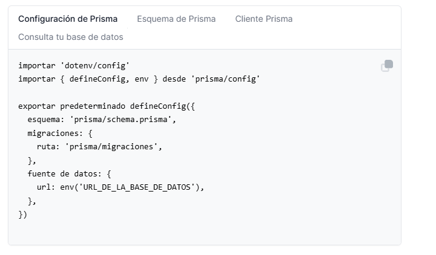

# Entrega Actividad - API Sistema de Gestión de Estudiantes

**Estudiante:** Carolina Bolivar Rios  

Repositorio del proyecto:  
https://github.com/CarolinaBolivar5/26_b2_r1

---

# 1. Enlace a la instancia de la base de datos creada en Prisma

Instancia de base de datos PostgreSQL creada en Prisma:

https://console.prisma.io/cmm2pebhc00sozxebewdafyid/cmm2vleg801q0zteeb6iv10re/cmm2vq2w201t87heef9x4wktg/dashboard

---

## Evidencias

### Configuración de Prisma

### Log de Spring Boot

### POST - Crear estudiante

### GET - Todos los estudiantes

### PUT - Actualizar estudiante

### DELETE - Eliminar estudiante

### Pruebas internas del proyecto

